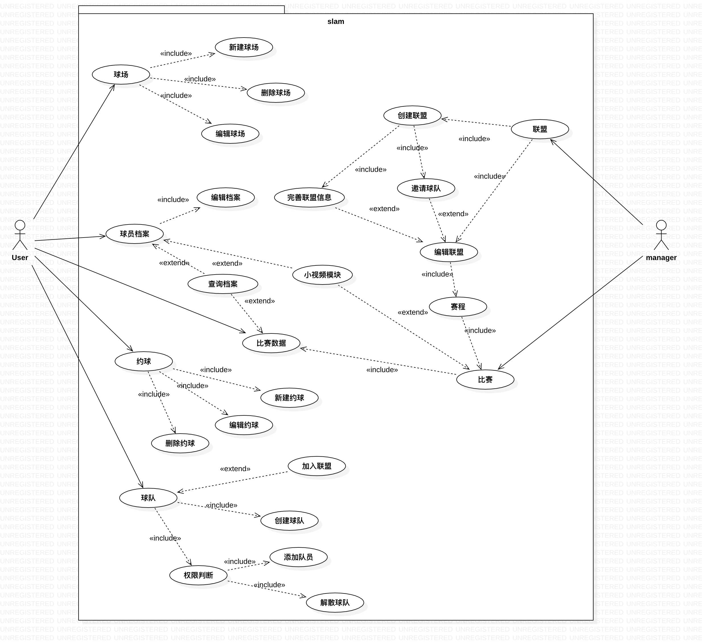
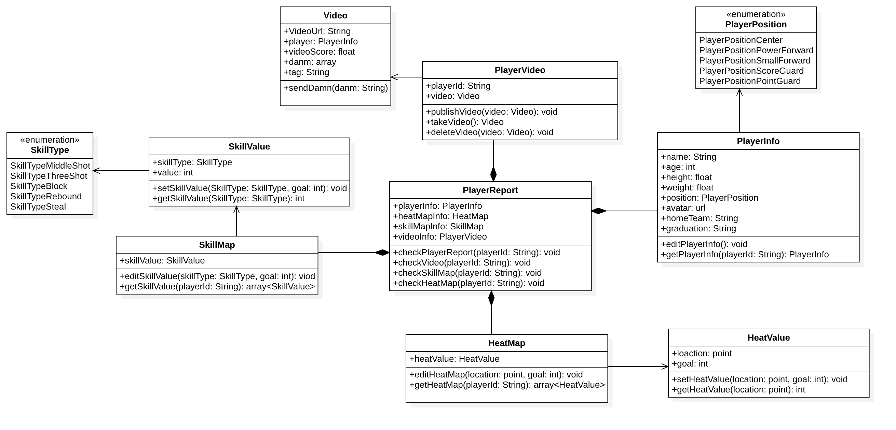
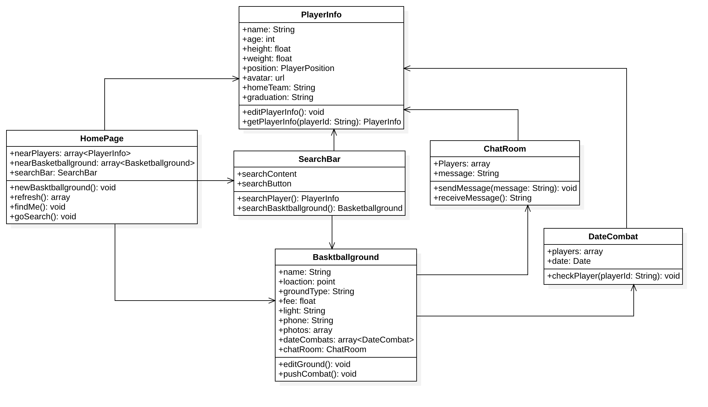
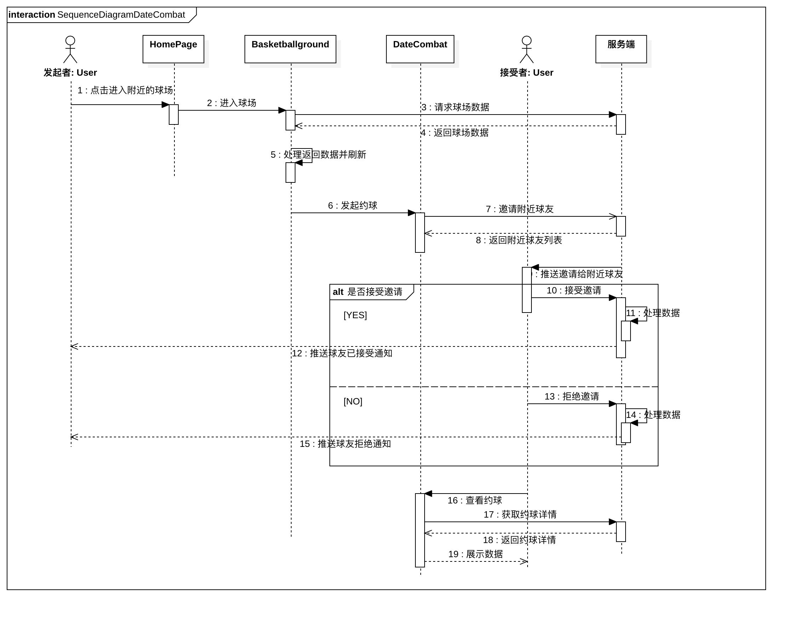
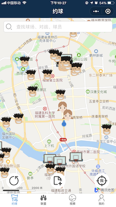
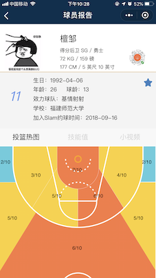
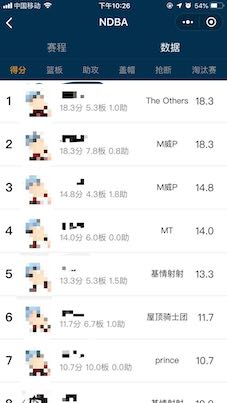
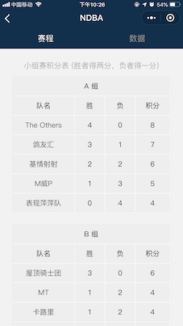
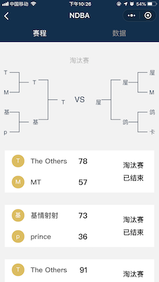

#  slam约球微信小程序开发文档

## 项目说明

slam约球是一款为篮球爱好者提供的篮球约战平台，用户可以创建球员档案、篮球场以及管理联盟，让周围的球友更加了解你，方便篮球爱好者相互交流。

## 模块

### 球员档案模块

球员档案模块主要用于展示球员的个体信息、以及球员属性、投篮热图等信息。用户在完善球员信息后，会在地图上显示球员的常驻位置，这样附近球友便可方便的发现周边潜在的球友，并通过球友档案快速的对其进行初步了解。

### 约球模块

用户可在小程序中将身边的真实篮球场添加到应用中，添加后球场会显示在地图上，用户点击地图上的球场图标可进入查看球场详情。在球场详情中可以进入发起约球，当发起约球后，便会将附近球友添加到约球中，等待附近球友确认是否加入。同时用户还可以在聊天室中讨论具体的约球事项。

### 联盟模块

用户可以将自己的篮球赛创建为一个联盟，比如校园篮球赛，让所有参赛队员都加入slam约球（只需在微信小程序中完善球员信息），各个球队领队或队长创建球队，并将队员添加到球队中，比赛组织方创建对应的联盟，再将所有的参赛队加入到联盟中即可。随着赛程的进行，组织方在赛程中编辑赛后数据，所有用户都可以在小程序中查看赛程积分、赛后球员数据等。

## UML

### 用例图

### 类图

#### 球员档案

#### 约球模块

### 时序图

## 最后献上slam约球小程序截图

